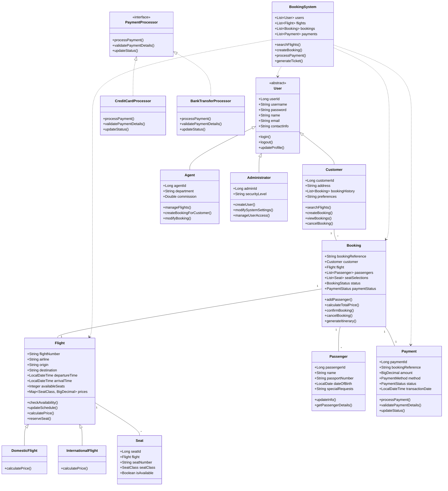

# FlightMatrix

## Flight Booking Management System

**Course:** CSE015 — Object-Oriented Programming  
**Institution:** Alamein International University  
**Semester/Year:** [Insert Semester/Year]  

A comprehensive web-based flight booking management system built with Spring Boot, demonstrating core Object-Oriented Programming (OOP) principles including inheritance, encapsulation, polymorphism, and abstraction. The system supports role-based access for customers, agents, and administrators, with a modern dark-mode UI themed around aviation.

---

## Table of Contents

- [Features](#features)
- [Architecture & OOP Principles](#architecture--oop-principles)
- [Tech Stack](#tech-stack)
- [Installation & Setup](#installation--setup)
- [Usage](#usage)
- [UML Class Diagram](#uml-class-diagram)
- [Sample Data](#sample-data)
- [API Endpoints](#api-endpoints)
- [Project Structure](#project-structure)
- [Contributing](#contributing)

---

## Features

### Core Functionality
- **Flight Search & Booking:** Search flights by origin, destination, date, and seat class
- **User Management:** Role-based authentication (Customer, Agent, Administrator)
- **Booking Management:** Create, view, confirm, and cancel bookings
- **Payment Processing:** Support for credit card and bank transfer payments
- **E-Ticket Generation:** Printable boarding passes with QR codes
- **Flight Inventory Management:** Agents can add/update flight schedules
- **Admin Dashboard:** User management and system oversight

### User Roles & Permissions
- **Customer:** Search flights, book tickets, manage bookings, make payments
- **Agent:** All customer features + manage flight inventory, create bookings for customers
- **Administrator:** All agent features + user management, system configuration

### Technical Highlights
- **OOP Design:** Full inheritance hierarchy, encapsulation, polymorphism, and abstraction
- **RESTful API:** Clean separation between frontend and backend
- **Responsive UI:** Pure HTML/CSS/JS with aviation-themed dark mode
- **Database:** SQLite with JPA/Hibernate ORM
- **Security:** Spring Security with session-based authentication

---

## Architecture & OOP Principles

This project rigorously implements the four pillars of Object-Oriented Programming:

### 1. Inheritance
- **Abstract Base Class:** `User` provides common attributes and methods
- **Specialized Subclasses:** `Customer`, `Agent`, `Administrator` extend `User`
- **Flight Hierarchy:** `Flight` → `DomesticFlight`, `InternationalFlight`

### 2. Encapsulation
- All entity fields are `private` with public getters/setters
- Password fields use write-only access (no plain getters)
- Business logic encapsulated within service classes

### 3. Polymorphism
- `calculatePrice()` method varies by flight type and seat class
- `generateTicket()` produces different outputs per booking type
- `PaymentProcessor` interface with multiple implementations

### 4. Abstraction
- `User` is an abstract class that cannot be instantiated directly
- `PaymentProcessor` interface hides payment method complexities
- Complex fare calculations abstracted behind service methods

### Class Relationships
- **Composition:** `Booking` owns `Passenger` list, `Flight` owns `Seat` list
- **Association:** `Customer` has-many `Booking`, `Booking` belongs-to `Flight`
- **Coordinator Pattern:** `BookingSystem` orchestrates across all services

---

## Tech Stack

### Backend
- **Framework:** Spring Boot 3.x
- **Language:** Java 17+
- **Database:** SQLite with JDBC driver
- **ORM:** Hibernate/JPA
- **Security:** Spring Security
- **Build Tool:** Maven

### Frontend
- **Markup:** Pure HTML5
- **Styling:** CSS3 with custom properties (CSS variables)
- **Scripting:** Vanilla JavaScript (ES6+)
- **Fonts:** Google Fonts (Plus Jakarta Sans, Inter, JetBrains Mono)
- **Icons:** Lucide Icons

### Development Tools
- **IDE:** IntelliJ IDEA or VS Code
- **Version Control:** Git
- **Database Tool:** SQLite Browser or DBeaver

---

## Installation & Setup

### Prerequisites
- Java 17 or higher
- Maven 3.8+
- Git

### Steps
1. **Clone the repository:**
   ```bash
   git clone <repository-url>
   cd flightmatrix
   ```

2. **Build the project:**
   ```bash
   mvn clean install
   ```

3. **Run the application:**
   ```bash
   mvn spring-boot:run
   ```

4. **Access the application:**
   - Open http://localhost:8080 in your browser
   - The SQLite database (`flightmatrix.db`) is created automatically
   - Sample data is seeded on first launch

### Sample Credentials
| Role          | Username    | Password   |
|---------------|-------------|------------|
| Administrator | `admin`     | `admin2024`|
| Agent         | `agent01`   | `agent2024`|
| Customer      | `traveler22`| `trip2023` |

---

## Usage

### Customer Flow
1. **Login** at the homepage (`/`)
2. **Search Flights** using the search form
3. **Select Flight** and proceed to booking
4. **Enter Passenger Details** and select seat class
5. **Confirm Booking** and proceed to payment
6. **Complete Payment** using credit card or bank transfer
7. **View E-Ticket** with boarding pass

### Agent Flow
1. **Login** with agent credentials
2. **Manage Flights** - add new flights or update existing ones
3. **Create Bookings** for customers
4. **View All Bookings** and modify as needed

### Administrator Flow
1. **Login** with admin credentials
2. **Manage Users** - create new agents/customers
3. **View System Logs** and statistics
4. **Configure System Settings**

---

## UML Class Diagram



---

## Sample Data

### Seeded Users
- **Administrator:** username=`admin`, password=`admin2024`
- **Agent:** username=`agent01`, password=`agent2024`
- **Customer:** username=`traveler22`, password=`trip2023`

### Seeded Flights
| Flight  | Airline       | Route                        | Departure | Arrival | Economy | Business | First Class |
|---------|---------------|------------------------------|-----------|---------|---------|----------|-------------|
| FM-101  | EgyptAir      | Cairo (CAI) → London (LHR)   | 08:00     | 14:30   | $517.50 | $1,430.00| $4,075.00  |
| FM-202  | British Airways| Cairo (CAI) → Dubai (DXB)    | 11:00     | 15:00   | $372.00 | $912.50  | $2,465.00  |
| FM-303  | EgyptAir      | Cairo (CAI) → New York (JFK) | 02:00     | 11:00   | $993.00 | $2,810.00| $6,950.00  |
| FM-404  | EgyptAir      | Cairo (CAI) → Alexandria (HBE)| 09:00    | 10:00   | $84.00  | $210.00  | $472.50    |

*Prices include taxes: International flights = base × 1.15 + $50; Domestic flights = base × 1.05*

---

## API Endpoints

### Authentication
- `POST /api/auth/login` - User login
- `POST /api/auth/logout` - User logout
- `POST /api/auth/register` - User registration

### Flights
- `GET /api/flights/search` - Search flights
- `GET /api/flights/{id}` - Get flight details
- `POST /api/flights` - Add new flight (Agent/Admin)
- `PUT /api/flights/{id}` - Update flight (Agent/Admin)

### Bookings
- `POST /api/bookings` - Create booking
- `GET /api/bookings/{reference}` - Get booking details
- `GET /api/bookings/my` - Get user's bookings
- `PUT /api/bookings/{reference}/cancel` - Cancel booking

### Payments
- `POST /api/payments/process` - Process payment
- `GET /api/payments/{reference}` - Get payment status

### Administration
- `GET /api/admin/users` - List all users (Admin)
- `POST /api/admin/users` - Create user (Admin)
- `DELETE /api/admin/users/{id}` - Delete user (Admin)

---

## Project Structure

```
flightmatrix/
├── src/main/java/com/flightmatrix/
│   ├── FlightMatrixApplication.java
│   ├── config/
│   │   ├── DatabaseConfig.java
│   │   └── SecurityConfig.java
│   ├── controller/
│   │   ├── AdminController.java
│   │   ├── AuthController.java
│   │   ├── BookingController.java
│   │   ├── FlightController.java
│   │   └── PaymentController.java
│   ├── dto/
│   │   ├── ApiResponse.java
│   │   ├── BookingRequest.java
│   │   ├── FlightRequest.java
│   │   ├── FlightSearchRequest.java
│   │   ├── LoginRequest.java
│   │   ├── PassengerRequest.java
│   │   ├── PaymentRequest.java
│   │   └── RegisterRequest.java
│   ├── entity/
│   │   ├── Administrator.java
│   │   ├── Agent.java
│   │   ├── Booking.java
│   │   ├── Customer.java
│   │   ├── DomesticFlight.java
│   │   ├── Flight.java
│   │   ├── InternationalFlight.java
│   │   ├── Passenger.java
│   │   ├── Payment.java
│   │   ├── Seat.java
│   │   └── User.java
│   ├── enums/
│   │   ├── BookingStatus.java
│   │   ├── PaymentMethod.java
│   │   ├── PaymentStatus.java
│   │   ├── SeatClass.java
│   │   └── UserRole.java
│   ├── interfaces/
│   │   └── PaymentProcessor.java
│   ├── payment/
│   │   ├── BankTransferProcessor.java
│   │   └── CreditCardProcessor.java
│   ├── repository/
│   │   ├── BookingRepository.java
│   │   ├── FlightRepository.java
│   │   ├── PassengerRepository.java
│   │   ├── PaymentRepository.java
│   │   └── UserRepository.java
│   ├── service/
│   │   ├── BookingService.java
│   │   ├── BookingSystem.java
│   │   ├── FlightService.java
│   │   ├── PaymentService.java
│   │   └── UserService.java
│   └── dto/ (additional DTOs if needed)
├── src/main/resources/
│   ├── application.properties
│   ├── static/
│   │   ├── assets/
│   │   │   └── logo.svg
│   │   ├── css/
│   │   │   ├── components.css
│   │   │   ├── navbar.css
│   │   │   └── theme.css
│   │   ├── js/
│   │   │   ├── api.js
│   │   │   ├── auth.js
│   │   │   ├── booking.js
│   │   │   ├── flights.js
│   │   │   └── payment.js
│   │   └── *.html (all pages)
│   └── templates/ (if using Thymeleaf)
├── flightmatrix.db
├── pom.xml
└── README.md
```

---

## Contributing

1. Fork the repository
2. Create a feature branch (`git checkout -b feature/amazing-feature`)
3. Commit your changes (`git commit -m 'Add amazing feature'`)
4. Push to the branch (`git push origin feature/amazing-feature`)
5. Open a Pull Request

---

## License

This project is developed as part of the CSE015 Object-Oriented Programming course at Alamein International University. All rights reserved.

---

## Acknowledgments

- Built with Spring Boot and SQLite
- UI designed with aviation-inspired dark theme
- Demonstrates comprehensive OOP implementation
- Developed for educational purposes
5. View booking at `/booking-detail.html?ref=FM-XXXXXX` → **Pay Now**
6. Complete payment at `/payment.html?ref=FM-XXXXXX`
7. View e-ticket at `/eticket.html?ref=FM-XXXXXX`

### Agent
1. Login → `/dashboard-agent.html`
2. Access all flights and create bookings on behalf of customers (supply Customer ID)

### Admin
1. Login → `/dashboard-admin.html`
2. Manage users at `/admin-users.html` (activate / deactivate accounts)

---

## Tech Stack

| Layer    | Technology                                       |
|----------|--------------------------------------------------|
| Backend  | Spring Boot 3.2.5, Java 17                       |
| Database | SQLite via `sqlite-jdbc` + Hibernate JPA         |
| Security | Spring Security — session-based, no JWT          |
| Frontend | Pure HTML / CSS / JS (no framework)              |
| Icons    | Lucide Icons                                     |
| Fonts    | Plus Jakarta Sans · Inter · JetBrains Mono       |

---

## OOP Principles Demonstrated

| Principle     | Where                                                                 |
|---------------|-----------------------------------------------------------------------|
| Abstraction   | `User` (abstract), `Flight` (abstract), `PaymentProcessor` interface |
| Inheritance   | `Customer`, `Agent`, `Administrator` extend `User`; `DomesticFlight`, `InternationalFlight` extend `Flight` |
| Polymorphism  | `calculatePrice(SeatClass)` overridden per flight type; `PaymentProcessor` strategy pattern |
| Encapsulation | All entity fields `private`; `password` write-only; `cardNumber`/`iban` `@JsonIgnore` |
| Composition   | `Booking` owns `List<Passenger>`; `BookingSystem` coordinates all services |

---

## Project Structure

```
src/main/java/com/flightmatrix/
├── entity/          User, Customer, Agent, Administrator, Flight,
│                    DomesticFlight, InternationalFlight, Booking,
│                    Passenger, Payment, Seat
├── enums/           UserRole, BookingStatus, PaymentStatus, SeatClass, PaymentMethod
├── interfaces/      PaymentProcessor
├── payment/         CreditCardProcessor, BankTransferProcessor
├── service/         BookingSystem (coordinator), UserService, FlightService,
│                    BookingService, PaymentService
├── controller/      AuthController, FlightController, BookingController,
│                    PaymentController, AdminController
├── dto/             ApiResponse, LoginRequest, RegisterRequest, BookingRequest,
│                    PassengerRequest, PaymentRequest, FlightRequest, FlightSearchRequest
├── config/          SecurityConfig, DatabaseConfig
└── repository/      UserRepository, FlightRepository, BookingRepository,
                     PassengerRepository, PaymentRepository

src/main/resources/static/
├── css/  theme.css, components.css, navbar.css
├── js/   api.js, auth.js, flights.js, booking.js, payment.js
└── *.html  (12 pages)
```

---

## API Reference

| Method | Endpoint                          | Access          | Description                  |
|--------|-----------------------------------|-----------------|------------------------------|
| POST   | `/api/auth/login`                 | Public          | Login                        |
| POST   | `/api/auth/register`              | Public          | Register as customer         |
| POST   | `/api/auth/logout`                | Authenticated   | Logout                       |
| GET    | `/api/auth/me`                    | Authenticated   | Current user info            |
| GET    | `/api/flights/search`             | Authenticated   | Search flights               |
| GET    | `/api/flights/all`                | Authenticated   | All flights                  |
| GET    | `/api/flights/{id}`               | Authenticated   | Flight by ID                 |
| POST   | `/api/flights`                    | Agent, Admin    | Add flight                   |
| PUT    | `/api/flights/{flightNumber}`     | Agent, Admin    | Update flight                |
| POST   | `/api/bookings`                   | Authenticated   | Create booking               |
| GET    | `/api/bookings/my`                | Authenticated   | My bookings                  |
| GET    | `/api/bookings/{ref}`             | Authenticated   | Booking detail               |
| PUT    | `/api/bookings/{ref}/cancel`      | Authenticated   | Cancel booking               |
| POST   | `/api/payments/process`           | Authenticated   | Process payment              |
| GET    | `/api/payments/{ref}`             | Authenticated   | Payment status               |
| GET    | `/api/admin/users`                | Admin only      | All users                    |
| PUT    | `/api/admin/users/{id}/activate`  | Admin only      | Activate user                |
| PUT    | `/api/admin/users/{id}/deactivate`| Admin only      | Deactivate user              |
